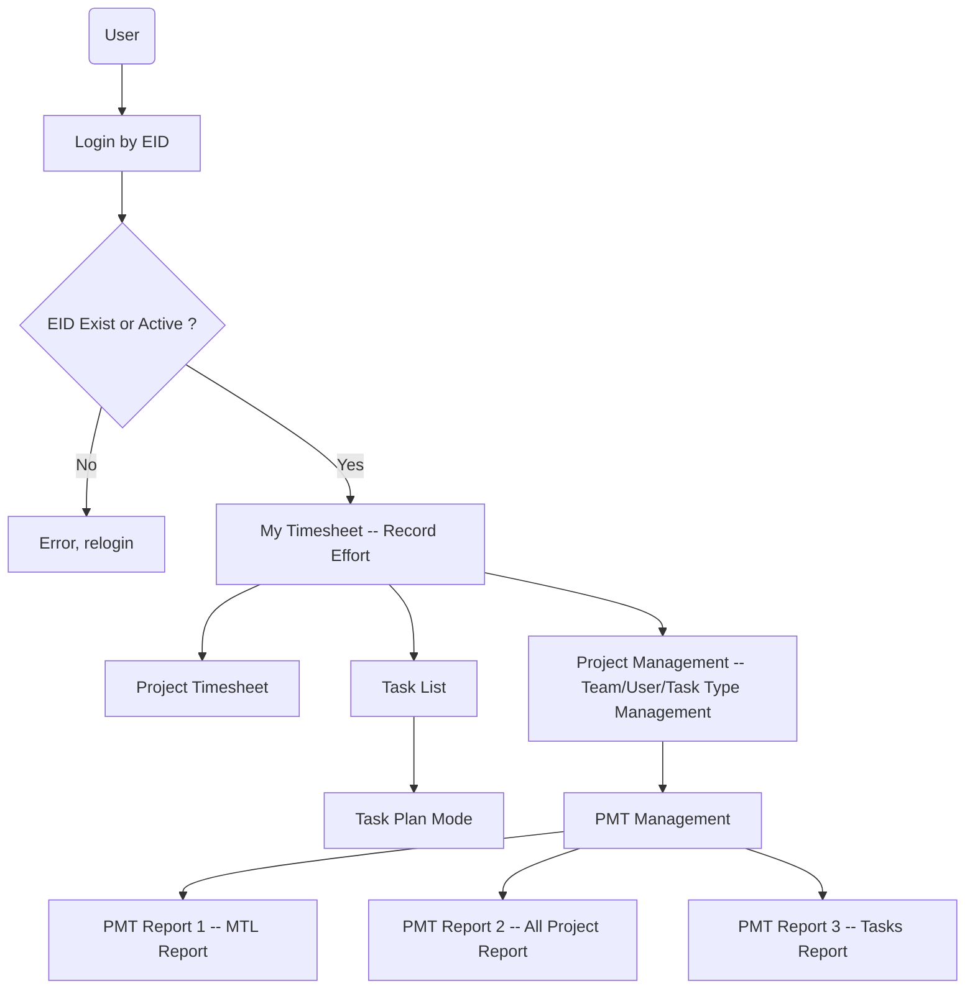
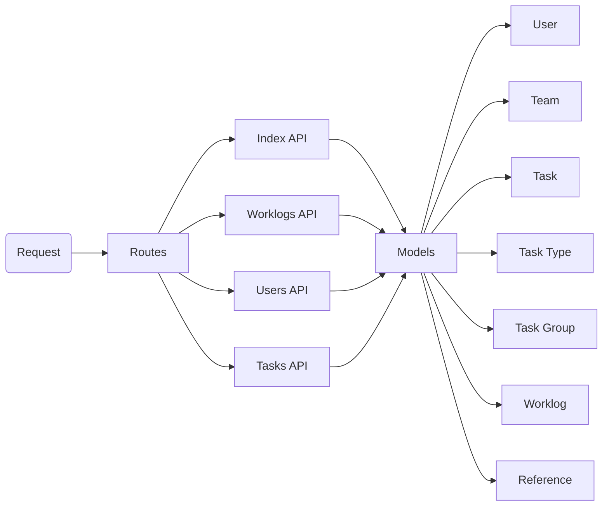

Project Management Timesheet (PMT)
=====================
## Environment Setup

### 1. Node.js Execution Environment
* Node.js(Version: 10.15.2) download address: <https://nodejs.org/download/release/v10.15.2/>
* After installation, open "CMD", input below command to check node.js and npm version. If node.js install successfully, can find the version information as below.

  > npm will be installed together with Node.js.

  
  
### 2. NPM Configuration
* Create "node_cache" and "node_global" folder under node.js installation root directory.

* Open "CMD", input below command:
    1. *npm config set prefix "XXXXXX\node_cache"*
    2. *npm config set cache "XXXXXX\node_global"*  
  
  > "XXXXXX" is your node.js installation path
  
* Configure environment variables
    1. Create "NODE_PATH": XXXXXX\node_global\node_modules
    2. Add to "PATH": XXXXXX\node_global\
  
> "XXXXXX" is your node.js installation path
    
* Install CNPM: 
    1. Open "CMD", input command: "*npm install -g cnpm --registry=https://registry.npm.taobao.org*" 
    2. Check CNPM version: *cnpm -v*
       

### 3. IDE Download and Configuration
* Visual Studio Code (VSCode) download address: <https://code.visualstudio.com/>
* Install some key components of VSCode:
    1. ESLint (**Important**)
    2. Auto Close Tag
    3. Auto Rename Tag
    4. GitLens
    5. Vetur
    6. HTML Snippets

### 4. Git Installation
* Git installation guideline can find in <https://www.liaoxuefeng.com/wiki/896043488029600>
* Register your account in GitHub: <https://github.com/>


### 5. Start to develop
* Config frontend:
  1. Fork the project to your own github, then clone frontend - PMT-Web to your local (project github: <https://github.com/WilsonLeungZS/PMT-Web/tree/public_branch>)
  2. Create file 'utils' -> 'res.js'
  3. Open 'Host' file in C: , add DNS configuration at the end: '127.0.0.1 pmt.gzatcc.com' 
      
    
  4. Open 'CMD', enter PMT-Web root folder
  5. Install package.js: execute command 'cnpm install'
  6. Start up PMT-Web: execute command 'cnpm run dev'
    > Start up successfully
    > 
```javascript
// res.js
const resBaseUrl = 'https://pmt.gzatcc.com:3000'
export default {
  resBaseUrl
}
```

* Config backend:
  1. Fork the project to your own github, then clone backend - PMTBackend to your local (project github: <https://github.com/WilsonLeungZS/PMTBackend/tree/public_branch>)
  2. Create file 'config' -> 'db.js'
  3. Get the https file, place under 'bin' 
  3. Open 'CMD', enter PMTBackend root folder
  4. Install package.js: execute command 'cnpm install'
  5. Start up PMTBackend: execute command 'set DEBUG=PMTBackend & cnpm start'
    > Start up successfully
    > 
```javascript
// db.js
const Sequelize = require('sequelize');
const sequelize = new Sequelize('pmt_dev', 'pmt_dev', 'XXXX', {
  host: 'mysql.gzatcc.com',
  port: 3306,
  dialect: 'mysql',
  timezone: '+8:00'
});
module.exports = sequelize;
```

## PMT Structure
### 1. Frontend PMT-Web
#### PMT Web introduction
###### (1) Technology
* **PMT-Web** = Vue.js + Element UI
  > **Vue.js**: Vue is a progressive framework for building user interfaces, it is designed from the ground up to be incrementally adoptable.

  > **Element UI**: Element, a Vue 2.0 based component library.
  
###### (2) Overview
* Login Page: ***Login.vue***


* Main Page: ***Main.vue + Content (MyTimesheet.vue/PrjTimesheet.vue/TaskList.vue/TaskPlan.vue/PrjManagement.vue/PmtManagement.vue)***


* Error Page: ***Error.vue***


###### (3) Business Flow


### 2. Backend PMT-Backend
#### Backend Interface Design
###### (1) Backend Structure
* **PMT-Backend** = Node.js + Express Framework + Sequelize ORM
  > **Express** is a minimal and flexible Node.js web application framework that provides a robust set of features for web and mobile applications.

  > **Sequelize** is a promise-based Node.js ORM for Postgres, MySQL, MariaDB, SQLite and Microsoft SQL Server. It features solid transaction support, relations, eager and lazy loading, read replication and more.

* **Express**: 
  Routing refers to determining how an application responds to a client request to a particular endpoint, which is a URI (or   path) and a specific HTTP request method (GET, POST, and so on).Each route can have one or more handler functions, which are executed when the route is matched.
1. Respond to GET request on the root route (/): 
```javascript
app.get('/', function (req, res) {
    var request = req.query.request;
    res.send('GET!')
});
```
2. Respond to POST request on the root route (/): 
```javascript
app.post('/', function (req, res) {
    var request = req.body.request;
    res.send('POST!')
});
```

* **Sequelize**:
1. Set up connection
```javascript
const sequelize = new Sequelize('pmt_dev', 'pmt_dev', '******', {
    host: 'mysql.gzatcc.com',
    port: 3306,
    dialect: 'mysql',
    timezone: '+8:00'
});
```
2. Modeling a table
```javascript
var Sequelize = require('sequelize');
var moment = require('moment');
var sequelize = require('../config/db'); // Import (1) DB connect

var Reference = sequelize.define('reference', {
    Id:{ 
        type:Sequelize.INTEGER,
        primaryKey: true,
        autoIncrement:true
    },
    Name: { type: Sequelize.STRING }, // Define field of table
    Type: { type: Sequelize.STRING },
    Value: { type: Sequelize.STRING },
    Remark: { type: Sequelize.STRING },
    createdAt: {
        type: Sequelize.DATE,
        allowNull: false,
        defaultValue: Sequelize.NOW,
        get() {
            return moment(this.getDataValue('createdAt')).format('YYYY-MM-DD HH:mm:ss'); // Define time format 
        }
    },
    updatedAt: {
        type: Sequelize.DATE,
        allowNull: false,
        defaultValue: Sequelize.NOW,
        get() {
            return moment(this.getDataValue('updatedAt')).format('YYYY-MM-DD HH:mm:ss');
        }
    }
}, {
    freezeTableName: false
});

Reference.sync();
module.exports = Reference;
```
3. Querying in routes
```javascript
var User = require('../model/user');

User.findOne({ // Select
    where: {
      Name: reqUserName,
      IsActive: true 
    }
  }).then(function(user) {
    if(user != null){
      user.update({ // Update
        ThemeStyle: reqThemeStyle 
      });
      return res.json(responseMessage(0, user, ''));
    } else {
      return res.json(responseMessage(1, null, 'User not exist'));
    }
  });
```



###### (2) API List
* API: **/index/**
    > This API is for external system. 
  
  | Interface              | Type | Description                                | Request | Response |
  | :--------------------- | :--- | :----------------------------------------- | :------ | :------- |
  | receiveTaskListForSNOW | POST | Receive task list from ServiceNow system   |         |          |
  | receiveTaskListForTRLS | POST | Receive task list from TRLS system         |         |          |
  | queryTimesheet         | POST | Return worklog records for external system |         |          |
  | queryTimesheetForTRLS  | POST | Return worklog records for TRLS system     |         |          |

* API: **/worklogs/**
    > This API is for worklogs/reports.. 
  
  | Interface                      | Type | Description                              | Request | Response |
  | :----------------------------- | :--- | :--------------------------------------- | :------ | :------- |
  | getWorklogByUserAndMonthForWeb | POST | Get monthly worklog records of each user |         |          |
  | getWorklogByTeamAndMonthForWeb | POST | Get monthly worklog records of each team |         |          |
  | getWorklogForWeb               | POST | Get worklog details                      |         |          |
  | addOrUpdateWorklog             | POST | Add or update worklogs                   |         |          |
  | removeWorklog                  | POST | Remove worklog record (Set effort = 0)   |         |          |
  | getWorklogHistoryByTaskId      | POST | Get worklog history for each task        |         |          |
  | extractReport1ForWeb           | POST | Extract PMT report 1                     |         |          |
  | extractReport2ForWeb           | POST | Extract PMT report 2                     |         |          |
  
* API: **/users/**
    > This API is for users/teams. 
  
  | Interface                   | Type | Description                                    | Request | Response |
  | :-------------------------- | :--- | :--------------------------------------------- | :------ | :------- |
  | getUserLevelById            | POST | Get user level                                 |         |          |
  | getUserThemeStyle           | GET  | Get user theme style id                        |         |          |
  | setUserThemeStyle           | GET  | Update user theme style                        |         |          |
  | login                       | GET  | User login PMT by user eid                     |         |          |
  | addOrUpdateUser             | POST | Add or update user information                 |         |          |
  | inactiveUser                | POST | Update user account status to inactive(1)      |         |          |
  | getUserList                 | GET  | Get active/all user list                       |         |          |
  | getUserListOrderByLevelDesc | GET  | Get active/all user list (order by level desc) |         |          |
  | getUserById                 | POST | Get user information                           |         |          |
  | getUserListByName           | POST | Get user list                                  |         |          |
  | getTeamList                 | GET  | Get team list                                  |         |          |
  | addOrUpdateTeam             | POST | Add or update team information                 |         |          |
  | inactiveTeam                | POST | Update team status to inactive(1)              |         |          |
  
* API: **/tasks/**
    > This API is for tasks/task types/task groups. 
  
  | Interface                       | Type | Description                                                  | Request | Response |
  | :------------------------------ | :--- | :----------------------------------------------------------- | :------ | :------- |
  | searchTaskByKeywordAndLevel     | GET  | Search task by keyword and task level                        |         |          |
  | getTaskList                     | GET  | Get task list by corresponding page and list size            |         |          |
  | getTaskListTotalSize            | GET  | Get requested task total count                               |         |          |
  | getTaskById                     | POST | Get task information by task id                              |         |          |
  | getTaskByName                   | POST | Get task information by task name                            |         |          |
  | getSubTaskByTaskName            | POST | Get sub tasks list by parent task name                       |         |          |
  | saveTask                        | POST | Create or update task information                            |         |          |
  | getTaskByNameForParentTask      | POST | Get task by name (For parent task input usage)               |         |          |
  | getTaskByNameForRefPool         | POST | Get task by name (For ref pool input usage)                  |         |          |
  | removeTaskIfNoSubTaskAndWorklog | POST | Remove task if target task no sub task and no effective worklog (worklog effort not 0 or change to 0 three days ago) |         |          |
  | getTaskByNameForWorklogTask     | POST | Get task by name (For worklog select task usage)             |         |          |
  | getLevel2TaskByParentTask       | POST | Get level 2 task by parent task name (For plan mode usage)   |         |          |
  | refreshLevel2TaskSubEstimation  | POST | Refresh level 2 task sub task estimation and sub task list   |         |          |
  | getPlanTaskSizeByParentTask     | POST | Get task total count for plan mode                           |         |          |
  | getPlanTaskListByParentTask     | POST | Get task list for plan mode                                  |         |          |
  | updateTaskGroupForPlanTask      | POST | Update task's task group                                     |         |          |
  | getTaskGroup                    | GET  | Get task gourp list by task group related task               |         |          |
  | getTaskGroupAll                 | GET  | Get all task group                                           |         |          |
  | addOrUpdateTaskGroup            | POST | Add or update task group information                         |         |          |
  | getAllTaskType                  | GET  | Get all task type                                            |         |          |
  | addTaskType                     | POST | Add or update task type                                      |         |          |
  | extractReport3ForWeb            | POST | Extract PMT report 3                                         |         |          |

#### Database Design
###### (1) Database Information
* Database: MySQL
> **Development Database**:
> Host: mysql.gzatcc.com
> Port: 3306
> User Name: pmt_dev
> Default Schema: pmt_dev

> **Production Database**:
> Host: mysql.gzatcc.com
> Port: 3306
> User Name: pmt
> Default Schema: pmt

###### (2) Database ER diagram


###### (3) Table Introduction
* Table: **worklogs**
    > This table is used to store each user's time cost (effort) of every task. 
  
  | Name         | Description              | Remark                                |
  | :----------- | :----------------------- | :------------------------------------ |
  | Id           | Primary Key              | Auto Increase                         |
  | WorklogMonth | Worklog's year and month | Value format: yyyy-mm                 |
  | WorklogDay   | Worklog's day            | 01 ~ 31                               |
  | Effort       | Time cost of each task   | Support 0.5 hours, less than 24 hours |
  | Remark       | Worklog remark           |                                       |
  | TaskId       | Worklog related task id  |                                       |
  | UserId       | Worklog recorder user id |                                       |
  
  * Table: **tasks**
    
    > This table is used to store each task information. 
  
  | Name                 | Description                                  | Remark                                                       |
  | :------------------- | :------------------------------------------- | :----------------------------------------------------------- |
  | Id                   | Primary Key                                  | 1 (Auto Increase)                                            |
  | ParentTaskName       | Task's parent task name                      | Each task's parent task only can be high level task (For level 1 task, this column = "N/A") |
  | TaskName             | Task name                                    | Task name cannot duplicate                                   |
  | TaskDescription      | Task Short Description(Title)                |                                                              |
  | Detail               | Task details                                 |                                                              |
  | Status               | Task status (Drafting/Planning/Running/Done) | For external system, will match to each status by "Reference" |
  | Creator              | Task creator                                 | PMT task will be "PMT:" + user's "EmployeeNumber"            |
  | Effort               | Task total effort cost                       |                                                              |
  | Estimation           | Task total estimation                        |                                                              |
  | IssueDate            | Task issue date                              | Value format: yyyy-mm-dd hh24:mi:ss                          |
  | TargetCompleteDate   | Task target complete date                    | Value format: yyyy-mm-dd                                     |
  | ActualCompleteDate   | Task actual complete date                    | Value format: yyyy-mm-dd                                     |
  | BusinessArea         | Task business area (refer to TRLS)           |                                                              |
  | BizProject           | Task business project (refer to TRLS)        |                                                              |
  | TaskLevel            | Task level (level 1 ~ 4)                     |                                                              |
  | RespLeaderId         | Task responsible leader user id              |                                                              |
  | AssigneeId           | Task assignee user id                        |                                                              |
  | *TopConstraint*      | Level 1 task constraint                      |                                                              |
  | *TopOppName*         | Level 1 task opportinity name                |                                                              |
  | *TopCustomer*        | Level 1 task customer                        |                                                              |
  | *TopFacingClient*    | Level task facing client                     |                                                              |
  | *TopTypeOfWork*      | Level 1 task type of work                    |                                                              |
  | *TopChanceWinning*   | Level 1 task winning chance                  |                                                              |
  | *TopSowConfirmation* | Level 1 task sow of confirmation             | Value format: yyyy-mm-dd                                     |
  | *TopBusinessValue*   | Level 1 task business value                  |                                                              |
  | *TopTargetStart*     | Level 1 task target start date               | Value format: yyyy-mm-dd                                     |
  | *TopTargetEnd*       | Level 1 task target end date                 | Value format: yyyy-mm-dd                                     |
  | *TopPaintPoints*     | Level 1 task paint points                    |                                                              |
  | *TopTeamSizing*      | Level 1 task team sizing                     |                                                              |
  | *TopSkill*           | Level 1 task need skill                      |                                                              |
  | *TopOppProject*      | Level 1 task project type                    |                                                              |
  | Reference            | Task reference of external task              |                                                              |
  | Scope                | Task baseline                                |                                                              |
  | TypeTag              | Task type tag                                |                                                              |
  | DeliverableTag       | Task deliverable tag                         |                                                              |
  | TaskTypeId           | Task type id                                 |                                                              |
  | TaskGroupId          | Task time group id                           |                                                              |
  
  * Table: **task_types**
    
    > This table is used to store each task's type. 
  
  | Name       | Description             | Remark            |
  | :--------- | :---------------------- | :---------------- |
  | Id         | Primary Key             | Auto Increase     |
  | ParentType | Task type's parent type |                   |
  | Name       | Task type name          |                   |
  | Prefix     | Task type name prefix   |                   |
  | Category   | Task type category      | AD/AM/Leave/Other |
  | Value      | Task type baseline      |                   |
  
   * Table: **task_groups**
    > This table is used to store each task's group. 
  
  | Name            | Description             | Remark                   |
  | :-------------- | :---------------------- | :----------------------- |
  | Id              | Primary Key             | Auto Increase            |
  | RelatedTaskName | Task group related task |                          |
  | Name            | Task group name         |                          |
  | StartTime       | Task group start date   | Value format: yyyy-mm-dd |
  | EndTime         | Task group end date     | Value format: yyyy-mm-dd |
  
   * Table: **users**
    > This table is used to store each user information. 
  
  | Name           | Description                                  | Remark                    |
  | :------------- | :------------------------------------------- | :------------------------ |
  | Id             | Primary Key                                  | Auto Increase             |
  | Name           | User name                                    |                           |
  | Email          | User email address                           |                           |
  | IsActive       | User account is active                       | 1 (active) / 0 (inactive) |
  | Role           | User role                                    | Admin/General/Special     |
  | ThemeStyle     | PMT theme style                              |                           |
  | Level          | User employee level                          |                           |
  | EmployeeNumber | User employee number                         |                           |
  | Assignment     | User assignment (related to external system) |                           |
  | NameMapping    | User name mapping to external system         |                           |
  | TeamId         | User team id                                 |                           |
  
   * Table: **teams**
    > This table is used to store each team information. 
  
  | Name        | Description          | Remark                    |
  | :---------- | :------------------- | :------------------------ |
  | Id          | Primary Key          | Auto Increase             |
  | Name        | Team name            |                           |
  | Description | Team description     |                           |
  | IsActive    | Team is active       | 1 (active) / 0 (inactive) |
  | Mapping     | Team mapping         |                           |
  | Project     | Team related project |                           |
  
  * Table: **Reference**
    
    > This table is used to store additional resources. 
  
  | Name   | Description      | Remark        |
  | :----- | :--------------- | :------------ |
  | Id     | Primary Key      | Auto Increase |
  | Name   | Reference name   |               |
  | Type   | Reference type   |               |
  | Value  | Reference value  |               |
  | Remark | Reference remark |               |
  
  
  